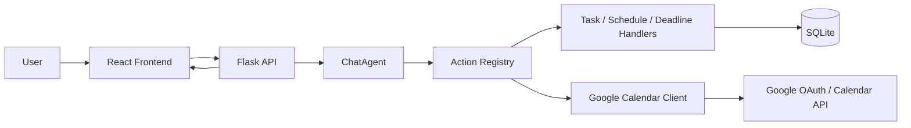

# TaskPilot

TaskPilot is an AI-powered task and scheduling assistant built with a lightweight
multi-agent architecture. It turns natural-language task input into structured
tasks, deadline summaries, schedules, weekly plans, and Google Calendar exports.

## Problem

People often capture work in plain language, but then still have to decide what
is urgent, what can wait, and how to move tasks into a calendar. TaskPilot
addresses that gap by combining conversation, planning, and export in one tool.

## Solution

TaskPilot lets a user:

- create and edit tasks from a dashboard or chat
- inspect deadline status and generated schedules
- produce a weekly assistant plan
- connect Google Calendar once and export later without reauthenticating

## Architecture

The application is split into a React frontend and a Flask backend.

- The frontend in [frontend](frontend) renders the dashboard and sends requests to `/api`.
- The backend in [app](app), [agents](agents), [actions](actions), [database](database), and [mcp](mcp) owns the logic, persistence, and integrations.
- The action registry defines the tool surface for the chatbot and gates mutating operations behind approval.
- SQLite stores tasks and Google OAuth refresh tokens locally.

The request pipeline is:

1. The user acts in the frontend.
2. The frontend calls the Flask API.
3. The API forwards chat requests to `ChatAgent` or handles direct dashboard actions.
4. `ChatAgent` selects a tool from the action registry.
5. The registry calls the correct backend handler.
6. Handlers read/write SQLite or call the Google Calendar client.
7. Results return to the API and then back to the UI.

## Diagram



## Setup

```bash
git clone <repo-url>
cd taskpilot

pip install -r requirements.txt
python -c "import taskpilot.database.db as db; db.create_tables()"
make frontend
```

For the React app and API separately:

```bash
PYTHONPATH=. python -m taskpilot.app.api
cd frontend && npm install && npm run dev
```

The frontend dev server proxies `/api` to the backend, so the browser stays on
one origin during Google login and session-based OAuth.

## Configuration

Set these values in `.env` as needed:

- `OPENAI_API_KEY` for LLM-powered chat
- `FLASK_SECRET_KEY` for session handling
- `GOOGLE_OAUTH_CLIENT_ID` and `GOOGLE_OAUTH_CLIENT_SECRET` for Google Calendar connect
- `GOOGLE_CALENDAR_ID` for the target calendar
- `GOOGLE_CALENDAR_TIMEZONE` for event timezone
- `VITE_API_BASE_URL` for APIR URL. Keep empty to use local deployment.

The backend derives the OAuth callback from the current origin in local
development. Only set `GOOGLE_OAUTH_REDIRECT_URI` if you deploy with a fixed
callback URL.

## Relevant Files

- [frontend/src/App.tsx](frontend/src/App.tsx) for the dashboard and direct actions
- [agents/chat_agent.py](agents/chat_agent.py) for assistant orchestration
- [actions/registry.py](actions/registry.py) for tool definitions and approvals
- [app/api.py](app/api.py) for Flask endpoints
- [mcp/google_calendar.py](mcp/google_calendar.py) for export logic
- [database/db.py](database/db.py) for SQLite persistence

## Notes

- Chat mutations require explicit user approval.
- Google OAuth is backend-managed.
- The project is designed for local development and single-user workflows.
